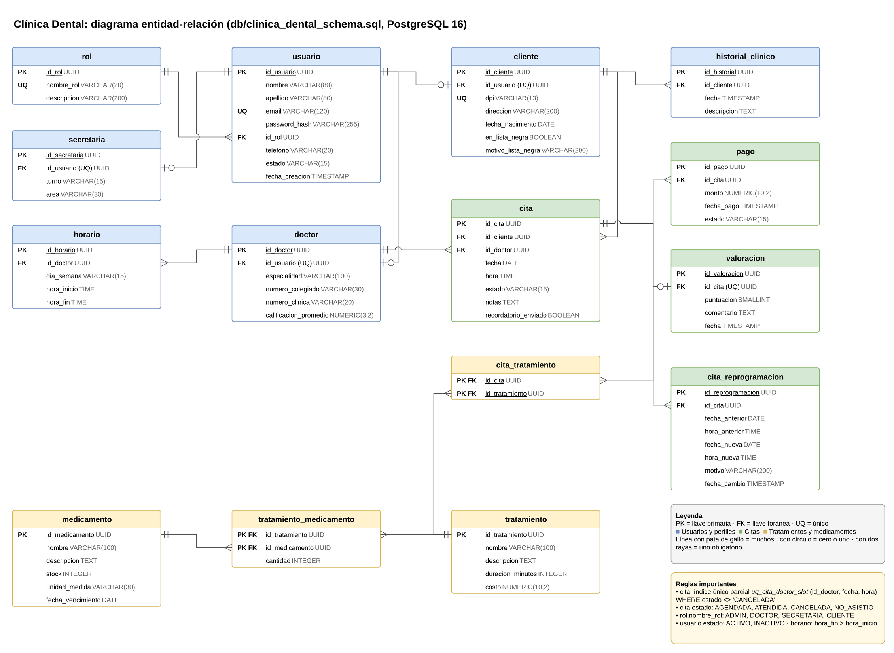
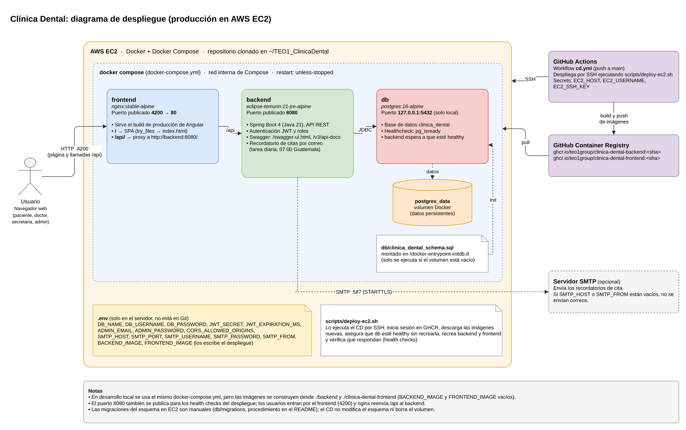
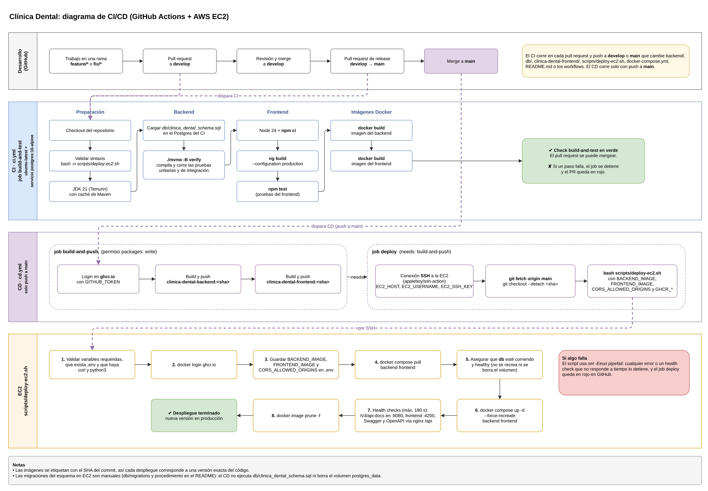

# TEO1_ClinicaDental

Sistema web para una clinica dental: registro de pacientes, doctores y horarios, agendamiento de citas sin solapamiento y recordatorios de citas.

## Requisitos

| Herramienta | Versión | Dónde se define |
|-------------|---------|-----------------|
| Java (JDK) | 21 | `backend/pom.xml` (`java.version`), `ci.yml`, `backend/Dockerfile` (`eclipse-temurin:21`) |
| Spring Boot | 4.1.1 | `backend/pom.xml` (parent `spring-boot-starter-parent`) |
| springdoc-openapi | 3.1.1 | `backend/pom.xml` |
| Maven | 3.9.16 mediante el wrapper `./mvnw` (wrapper 3.3.4); no hace falta instalar Maven | `backend/.mvn/wrapper/maven-wrapper.properties` |
| Node.js | 24.15.0 | `ci.yml`, `clinica-dental-frontend/Dockerfile` (`node:24.15.0-alpine`) |
| npm | 11 (`npm@11.19.0`) | `clinica-dental-frontend/package.json` (`packageManager`) |
| Angular | 22.1 (`@angular/core` 22.1.5 en `package-lock.json`) | `clinica-dental-frontend/package.json` |
| PostgreSQL | 16 | `docker-compose.yml` y `ci.yml` (`postgres:16-alpine`) |
| Docker | Docker Engine con el plugin Compose v2 (comando `docker compose`, no `docker-compose`) | `docker-compose.yml` |

Con Docker solo se necesita Docker con Compose v2 y `openssl`. Sin Docker se necesitan JDK 21, Node.js 24.15.0 con npm 11 y PostgreSQL 16 con los clientes `psql` y `createdb`.

Estructura del repositorio:

- `backend/`: API REST en Spring Boot con Spring Security (JWT), JPA y PostgreSQL. El código está en `backend/src/main/java/com/teo1/clinicadental/` (`controller`, `service`, `repository`, `model`, `dto`, `security`, `config`, `exception`).
- `clinica-dental-frontend/`: aplicación Angular. Llama al backend con el prefijo `/api` (en desarrollo lo redirige `proxy.conf.json` y en Docker lo hace `nginx.conf`).
- `db/clinica_dental_schema.sql`: esquema completo para una base vacía. `db/migrations/`: cambios para bases que ya tienen datos.
- `scripts/deploy-ec2.sh`: script que ejecuta el CD dentro de la instancia EC2.
- `.github/workflows/`: `ci.yml` y `cd.yml`.

## Levantar con Docker

Desde la raíz del repositorio:

```bash
cp .env.example .env
openssl rand -base64 32
```

Abre `.env` y llena como mínimo:

- `DB_PASSWORD`: la contraseña que tendrá PostgreSQL.
- `JWT_SECRET`: pega la salida del comando `openssl rand -base64 32`.
- `ADMIN_EMAIL` y `ADMIN_PASSWORD`: credenciales del primer administrador (ver [Primer ingreso y cómo probarlo](#primer-ingreso-y-cómo-probarlo)).

Las variables `SMTP_*` son opcionales: si `SMTP_HOST` o `SMTP_FROM` quedan vacíos, el backend arranca igual y no envía los correos de recordatorio de citas.

```bash
docker compose up --build
```

La primera vez que se crea el volumen `postgres_data`, el contenedor `db` carga `db/clinica_dental_schema.sql` automáticamente.

- Frontend: http://localhost:4200
- Backend: http://localhost:8080
- Swagger UI directo al backend: http://localhost:8080/swagger-ui.html
- OpenAPI JSON directo al backend: http://localhost:8080/v3/api-docs
- Swagger UI a través del proxy nginx: http://localhost:4200/api/swagger-ui.html
- OpenAPI JSON a través del proxy nginx: http://localhost:4200/api/v3/api-docs

Si el puerto 5432 ya está ocupado (por ejemplo en macOS), configura solo en el `.env` local ignorado por Git `DB_HOST_PORT=5434` y `DB_URL=jdbc:postgresql://localhost:5434/clinica_dental`. El backend dentro de Docker sigue conectándose a `db:5432`; el puerto publicado por defecto continúa siendo 5432.

## Levantar sin Docker

Requiere PostgreSQL 16 escuchando en `localhost:5432`. Desde la raíz del repositorio, crea la base y carga el esquema (`psql` y `createdb` piden la contraseña del usuario `postgres`):

```bash
createdb -h localhost -U postgres clinica_dental
psql -h localhost -U postgres -d clinica_dental -v ON_ERROR_STOP=1 -f db/clinica_dental_schema.sql
```

El esquema empieza con `DROP TABLE`: úsalo solo en una base nueva o de desarrollo.

Backend, en una terminal desde la raíz del repositorio. Usa el mismo `.env` de la sección anterior (`cp .env.example .env` y llénalo si aún no existe); `DB_PASSWORD` debe ser la contraseña de tu PostgreSQL local:

```bash
set -a
. ./.env
set +a
cd backend
./mvnw spring-boot:run
```

Frontend, en otra terminal desde la raíz del repositorio:

```bash
cd clinica-dental-frontend
npm ci
npm start
```

- Frontend: http://localhost:4200 (`npm start` ejecuta `ng serve` con `proxy.conf.json`, que envía `/api` a `http://localhost:8080`)
- Swagger UI: http://localhost:8080/swagger-ui.html

Para detener cada proceso usa `Ctrl+C` y vuelve a la raíz con `cd ..`.

## Variables de entorno

El archivo `.env` contiene secretos y **no se sube a Git** (está en `.gitignore`). En el repositorio solo está `.env.example`, sin valores secretos.

| Variable | Para qué sirve | Obligatoria |
|----------|----------------|-------------|
| `DB_NAME` | Nombre de la base que crea el contenedor `db` y que usa el backend en Docker | No (por defecto `clinica_dental`) |
| `DB_USERNAME` | Usuario de PostgreSQL | No (por defecto `postgres`) |
| `DB_PASSWORD` | Contraseña de PostgreSQL | Sí |
| `DB_HOST_PORT` | Puerto del host donde Compose publica PostgreSQL (solo en `127.0.0.1`) | No (por defecto `5432`) |
| `DB_URL` | URL JDBC del backend cuando corre fuera de Docker o en las pruebas. En Docker, Compose la arma con `db:5432` | No (por defecto `jdbc:postgresql://localhost:5432/clinica_dental`) |
| `JWT_SECRET` | Clave en base64 para firmar los tokens JWT | Sí |
| `JWT_EXPIRATION_MS` | Duración del token en milisegundos | No (por defecto `86400000`, 24 horas) |
| `CORS_ALLOWED_ORIGINS` | Orígenes permitidos por CORS, separados por comas | No (por defecto `http://localhost:4200`; en EC2 lo escribe el CD) |
| `ADMIN_EMAIL` | Email del primer administrador | Sí para poder entrar la primera vez |
| `ADMIN_PASSWORD` | Contraseña del primer administrador | Sí para poder entrar la primera vez |
| `SMTP_HOST` | Servidor SMTP para los correos de recordatorio | No (vacío desactiva los correos) |
| `SMTP_PORT` | Puerto SMTP (STARTTLS) | No (por defecto `587`) |
| `SMTP_USERNAME` | Usuario SMTP | No |
| `SMTP_PASSWORD` | Contraseña SMTP | No |
| `SMTP_FROM` | Remitente de los correos | No (vacío desactiva los correos) |
| `BACKEND_IMAGE` | Imagen del backend. Vacía en local (se construye desde `./backend`); en EC2 la escribe `deploy-ec2.sh` | No |
| `FRONTEND_IMAGE` | Imagen del frontend. Vacía en local (se construye desde `./clinica-dental-frontend`); en EC2 la escribe `deploy-ec2.sh` | No |

Valores fijos en `backend/src/main/resources/application.properties` (no son variables de entorno): zona horaria `America/Guatemala`, duración de cada cita de 30 minutos y envío diario de recordatorios por correo a las 07:00.

## Primer ingreso y cómo probarlo

El administrador inicial lo crea `AdminInitializer` al arrancar el backend, con `ADMIN_EMAIL` y `ADMIN_PASSWORD` del `.env`:

- Solo lo crea si ambas variables tienen valor y todavía no existe ningún usuario con rol ADMIN.
- Si ya existe un ADMIN no hace nada: cambiar `ADMIN_PASSWORD` después no cambia la contraseña del administrador existente.
- Si el email ya pertenece a otro usuario, no lo crea y deja un aviso en el log del backend.

En el despliegue de EC2 el administrador es `admin@clinica.com`. Su contraseña es la `ADMIN_PASSWORD` del `.env` del servidor: no se publica en el repositorio y se entrega al equipo evaluador por un canal privado.

Las contraseñas de usuarios nuevos deben tener al menos 8 caracteres, con una mayúscula, una minúscula, un número y un carácter especial. Usa la misma regla para `ADMIN_PASSWORD`.

Prueba completa en http://localhost:4200 (o en la URL de EC2):

1. Inicia sesión con `ADMIN_EMAIL` y `ADMIN_PASSWORD`. En EC2 usa el usuario `admin@clinica.com`.
2. En **Usuarios**, crea un usuario con rol DOCTOR (la especialidad es obligatoria) y otro con rol SECRETARIA.
3. En **Doctores**, abre el doctor y agrégale un horario, por ejemplo de 08:00 a 12:00 el día de mañana. Un horario que se traslapa con otro del mismo día se rechaza.
4. Cierra sesión y registra un paciente en `/registro` (DPI de 13 dígitos). Registra un segundo paciente igual.
5. Entra como el primer paciente y ve a **Citas > Nueva Cita**: elige el doctor, mañana, a las 09:00. La cita queda Agendada. Cada cita dura 30 minutos.
6. Solapamiento: entra como el segundo paciente y pide el mismo doctor, mañana, a las 09:15. Se rechaza con "El doctor ya tiene una cita agendada en ese horario". A las 09:30 sí se acepta, porque empieza justo cuando termina la anterior.
7. Fuera de horario: pide las 11:45 (terminaría a las 12:15) o un día sin horario. Se rechaza con "La cita no cabe dentro del horario de atencion del doctor".
8. Como SECRETARIA (o ADMIN), en **Citas > Nueva Cita** se elige también el paciente.
9. Cancelar: en **Citas**, el paciente cancela su cita de las 09:30. La hora queda libre y se puede volver a agendar.
10. Atendida o no asistió: entra como el doctor o la secretaria; en **Citas** el doctor ve solo sus citas y la secretaria ve todas, y ambos pueden marcarlas como Atendida o No asistió. Solo las citas Agendadas cambian de estado; los demás estados son finales.
11. Campana de recordatorios: como paciente o como doctor, la campana del encabezado muestra las citas Agendadas de las próximas 48 horas y, al iniciar sesión, aparece un aviso con cuántas hay. La campana se actualiza al iniciar sesión o al recargar la página. ADMIN y SECRETARIA no ven la campana ni reciben recordatorios.
12. Swagger: abre la URL de Swagger UI, ejecuta `POST /auth/login`, copia el valor de `token`, pulsa **Authorize** y pégalo (solo el token, sin la palabra `Bearer`). Después prueba, por ejemplo, `GET /citas/proximas`.

## Roles y permisos

Según `SecurityConfig` y `CitaService`:

| Acción | ADMIN | SECRETARIA | DOCTOR | CLIENTE |
|--------|-------|------------|--------|---------|
| Registrarse en `/registro` | - | - | - | Sí (público) |
| Crear, editar y activar o desactivar usuarios del personal; ver roles | Sí | No | No | No |
| Ver pacientes y su detalle | Sí | Sí | Sí | No |
| Crear, editar y desactivar pacientes | Sí | Sí | No | No |
| Lista negra de pacientes | No | Sí | No | No |
| Ver historial clínico | Sí | Sí | Sí | No |
| Agregar al historial clínico | Sí | No | Sí | No |
| Ver doctores y sus horarios | Sí | Sí | Sí | Sí |
| Editar y desactivar doctores | Sí | No | No | No |
| Crear, editar y eliminar horarios | Sí | Sí | Solo los suyos | No |
| Agendar citas | Sí, eligiendo paciente | Sí, eligiendo paciente | No | Sí, solo para sí mismo |
| Ver citas | Todas | Todas | Solo las suyas | Solo las suyas |
| Cancelar una cita | Cualquiera | Cualquiera | No | Solo las suyas |
| Marcar Atendida o No asistió | Cualquiera | Cualquiera | Solo las suyas | No |
| Recordatorios en la campana y aviso al ingresar (`GET /citas/proximas`) | No | No | Sus citas de las próximas 48 h | Sus citas de las próximas 48 h |
| Correo de recordatorio | No lo recibe | No lo recibe | No lo recibe | Lo recibe el paciente de la cita |

Una cita solo puede cambiar de estado mientras está Agendada. Al agendar también se valida que el doctor y el paciente estén activos, que el paciente no esté en lista negra y que la fecha y hora sean futuras. Una cita cancelada libera su horario.

El token se valida en cada petición; si un usuario se desactiva, su token deja de servir al momento.

## API (Swagger)

Swagger/OpenAPI es la fuente principal y actualizada de documentación de la API. Documenta todas las operaciones de los controllers: autenticación, usuarios, pacientes, doctores y horarios, y citas (agendar, listar, obtener, cambiar estado y próximas).

- Local: http://localhost:8080/swagger-ui.html (directo al backend) o http://localhost:4200/api/swagger-ui.html (a través de nginx en Docker).
- EC2: http://18.226.37.148:4200/api/swagger-ui/index.html y el JSON en http://18.226.37.148:4200/api/v3/api-docs.

Para probar operaciones protegidas: ejecuta `POST /auth/login`, copia el `token` de la respuesta, pulsa **Authorize** (esquema `bearerAuth`) y pega solo el token.

## Pruebas

Las pruebas de integración del backend necesitan PostgreSQL con el esquema cargado. Con Compose, inicia la base de datos y exporta las variables de `.env` antes de ejecutar Maven (Maven no carga `.env` por sí solo). Desde la raíz del repositorio:

```bash
docker compose up -d db
set -a
. ./.env
set +a
cd backend
./mvnw verify
cd ..
```

Si el volumen `postgres_data` se creó con un esquema anterior, aplica antes las migraciones de `db/migrations/`. La mayoría de las pruebas de integración se revierten al terminar; `CitasConcurrencyIntegrationTests` guarda datos reales y los borra al final, así que usa una base de desarrollo, nunca la de producción.

Frontend, desde la raíz del repositorio (son los mismos comandos del CI):

```bash
cd clinica-dental-frontend
npm ci
npm test -- --no-watch --no-progress
npm run build -- --configuration production
cd ..
```

## CI/CD y despliegue en EC2

- `ci.yml` corre en cada push y pull request hacia `main` o `develop` que modifique `backend/**`, `db/**`, `clinica-dental-frontend/**`, `scripts/deploy-ec2.sh`, `docker-compose.yml`, `README.md`, `ci.yml` o `cd.yml`. Levanta PostgreSQL 16, carga `db/clinica_dental_schema.sql`, ejecuta `./mvnw -B verify` sin SMTP, compila el frontend en producción, ejecuta sus pruebas y construye las dos imágenes Docker.
- `cd.yml` corre solo en push a `main` que modifique `backend/**`, `clinica-dental-frontend/**`, `db/**`, `scripts/deploy-ec2.sh`, `docker-compose.yml` o `cd.yml`. **El despliegue solo sale de `main`**: lo que está en `develop` no llega a EC2 hasta fusionarlo en `main`. El CD no espera al CI. Construye y publica las imágenes en GHCR con el SHA del commit, se conecta por SSH a EC2 (secrets `EC2_HOST`, `EC2_USERNAME`, `EC2_SSH_KEY`), deja el checkout en ese SHA y ejecuta `scripts/deploy-ec2.sh`.

`deploy-ec2.sh` valida las variables y el `.env`, inicia sesión en GHCR, escribe `BACKEND_IMAGE`, `FRONTEND_IMAGE` y `CORS_ALLOWED_ORIGINS` en `.env`, descarga las imágenes y espera a que la base esté sana.
Después recrea solo backend y frontend y espera hasta 180 segundos a que respondan `/v3/api-docs`, el frontend, Swagger UI y OpenAPI a través de nginx; si alguno no responde, el despliegue falla.

El CD no aplica migraciones de base de datos: se hacen a mano, antes de desplegar, siguiendo [Migraciones manuales de esquema](#migraciones-manuales-de-esquema).

Despliegue actual:

- Frontend: http://18.226.37.148:4200
- Swagger UI: http://18.226.37.148:4200/api/swagger-ui/index.html
- OpenAPI JSON: http://18.226.37.148:4200/api/v3/api-docs

### Migraciones manuales de esquema

Las migraciones se aplican manualmente y por separado del despliegue de aplicaciones. El workflow de CD no modifica el esquema de PostgreSQL ni elimina el volumen `postgres_data`.

> **No ejecutes `db/clinica_dental_schema.sql` sobre EC2 ni sobre una base con datos.** Ese archivo contiene instrucciones `DROP TABLE` y es solo para inicializar una base vacía.

Realiza los pasos siguientes desde `~/TEO1_ClinicaDental` en el servidor, con acceso autorizado a la base. No actives `set -x` ni incluyas contraseñas en los comandos.

1. **Inspecciona antes de cambiar.** Confirma que `docker compose ps db` muestra la base esperada como activa. Abre una sesión `psql` para revisar `\d+ cita` y los estados existentes:

   ```bash
   docker compose exec -it db sh -lc 'psql -U "$POSTGRES_USER" -d "$POSTGRES_DB"'
   ```

   Antes de crear el índice parcial, busca horarios activos duplicados:

   ```sql
   SELECT id_doctor, fecha, hora, count(*)
   FROM cita
   WHERE estado <> 'CANCELADA'
   GROUP BY id_doctor, fecha, hora
   HAVING count(*) > 1;
   ```

   La consulta debe devolver cero filas. Si devuelve resultados, detén el procedimiento y resuelve el conflicto con el responsable de los datos; no borres ni combines citas automáticamente.

2. **Crea un respaldo antes de migrar.** El siguiente ejemplo guarda un archivo de modo privado en el servidor; el contenedor usa las credenciales ya configuradas por Compose y el comando no imprime valores secretos:

   ```bash
   set -euo pipefail
   umask 077
   backup_file="../clinica_dental_$(date +%Y%m%d_%H%M%S).dump"
   docker compose exec -T db sh -lc \
     'pg_dump --format=custom --no-owner -U "$POSTGRES_USER" -d "$POSTGRES_DB"' \
     > "$backup_file"
   ```

3. **Valida el archivo de respaldo antes de continuar.** Esto comprueba que `pg_restore` puede leer su catálogo:

   ```bash
   docker compose exec -T db pg_restore --list - < "$backup_file" > /dev/null
   ```

   Conserva el archivo fuera del repositorio y verifica que esté incluido en el mecanismo de respaldo aprobado para EC2. Un archivo legible no demuestra por sí solo que pueda restaurarse con éxito; la restauración debe ensayarse en una base aislada.

4. **Aplica la migración con errores fatales.** Solo después del respaldo y las verificaciones previas:

   ```bash
   docker compose exec -T db sh -lc \
     'psql -U "$POSTGRES_USER" -d "$POSTGRES_DB" -v ON_ERROR_STOP=1' \
     < db/migrations/2026-10-sprint4-cita.sql
   ```

   La migración abre una transacción. `ON_ERROR_STOP=1` hace que `psql` termine ante un error SQL; PostgreSQL revierte la transacción al cerrar la conexión. Corrige la causa y vuelve a inspeccionar antes de reintentar.

5. **Verifica el resultado antes de desplegar el backend.** Confirma las columnas, estados y definición del índice:

   ```bash
   docker compose exec -T db sh -lc \
     'psql -U "$POSTGRES_USER" -d "$POSTGRES_DB" -v ON_ERROR_STOP=1' <<'SQL'
   \d+ cita
   SELECT estado, count(*) FROM cita GROUP BY estado ORDER BY estado;
   SELECT column_name, data_type, is_nullable, column_default
   FROM information_schema.columns
   WHERE table_name = 'cita' AND column_name = 'recordatorio_enviado';
   SELECT indexdef FROM pg_indexes
   WHERE tablename = 'cita' AND indexname = 'uq_cita_doctor_slot';
   SQL
   ```

   Compara el total de citas con la inspección previa. Los estados antiguos se transforman así: `COMPLETADA` a `ATENDIDA`, `INASISTENCIA` a `NO_ASISTIO` y `APLAZADA` a `AGENDADA`. No se eliminan filas. El índice parcial permite reutilizar horarios cancelados y conserva la unicidad de los demás.

6. **Despliega y verifica en este orden:** respaldo validado, migración aplicada, consultas posteriores correctas, despliegue de backend/frontend y comprobaciones de salud del CD. El backend usa `ddl-auto=validate`; no crea ni altera tablas automáticamente, y no arranca si falta la columna `recordatorio_enviado`.

Si falla la migración, no despliegues el backend nuevo. La transacción evita cambios parciales de esta migración, pero no revierte acciones ejecutadas fuera de ella ni protege contra fallos de disco o intervención externa. Si se necesita restaurar, detén el cambio y coordina una recuperación autorizada: restaura primero el respaldo en una base separada y valida los datos antes de decidir si reemplazar la base activa. Restaurar encima de la base activa puede borrar escrituras posteriores, y el respaldo puede contener información personal; no lo copies a Git ni lo compartas sin autorización.

### Obtener el archivo de migración desde el commit aprobado

El checkout de `main` en EC2 puede no contener todavía la migración que está en `develop`. No cambies de rama ni hagas checkout del release para obtenerla. Después de aprobar el SHA de `develop` y el SHA-256 del archivo, puedes extraer esa versión exacta sin mover el checkout desplegado:

```bash
set -euo pipefail
umask 077
git fetch origin develop
migration_commit='<SHA-COMPLETO-APROBADO-DE-DEVELOP>'
git cat-file -e "${migration_commit}^{commit}"
migration_file="../2026-10-sprint4-cita-${migration_commit}.sql"
git show "${migration_commit}:db/migrations/2026-10-sprint4-cita.sql" > "$migration_file"
sha256sum "$migration_file"
```

Compara el SHA-256 con el valor comunicado en la revisión aprobada antes de continuar. Ejecuta el archivo extraído únicamente después de completar el preflight, respaldo y autorización descritos arriba, usando `< "$migration_file"` en lugar de `< db/migrations/2026-10-sprint4-cita.sql` en el paso 4. `git fetch` solo actualiza referencias/objetos de Git; no despliega ni cambia el checkout activo.

### Recuperación de backend y frontend

Antes de publicar imágenes nuevas, guarda una copia privada del `.env` actual fuera del repositorio. Contiene configuración sensible y debe conservar permisos restrictivos:

```bash
set -euo pipefail
umask 077
release_env_backup="../clinica_dental_env_$(date +%Y%m%d_%H%M%S).bak"
cp .env "$release_env_backup"
```

Si falla la comprobación de salud del backend o frontend, conserva los logs y no vuelvas a desplegar automáticamente. Para recuperar la versión anterior de aplicación, restaura esa copia, verifica que sus `BACKEND_IMAGE` y `FRONTEND_IMAGE` sean las imágenes anteriores y recrea solo esos dos servicios:

```bash
cp "$release_env_backup" .env
docker compose up -d --no-build --no-deps --force-recreate backend frontend
docker compose ps
```

La recreación usa las imágenes anteriores que dejó en caché el paso de `pull` del despliegue fallido; si alguna no está disponible localmente, vuelve a autenticar Docker en GHCR por el mecanismo aprobado antes de intentar descargarla. Confirma Swagger/OpenAPI, la interfaz y el acceso a PostgreSQL antes de reanudar el servicio. No reviertas automáticamente el esquema: una restauración de PostgreSQL es una acción separada que puede borrar escrituras posteriores y requiere decisión autorizada.

## Equipo y fecha

| Nombre         | Rol | Usuario de GitHub |
|----------------|-----|-------------------|
| Mynor Monzon   | Backend y Scrum Master | [Mynor-M-50](https://github.com/Mynor-M-50) |
| Carlos Lopez   | Backend e infraestructura AWS | [CarlosL62](https://github.com/CarlosL62) |
| Luis Regalado  | Base de datos y backend | [LuisRV2112](https://github.com/LuisRV2112) |
| Herson Aguilar | Frontend | [HersonAJ](https://github.com/HersonAJ) |
| Yohana Perez   | Frontend | [yoha-lab-202030086](https://github.com/yoha-lab-202030086) |

Ultima revision: 2026-10-08

## Diagramas

Los archivos `.drawio` se abren y editan en https://app.diagrams.net.

### Diagrama entidad-relación



Editable: [docs/diagramas/diagrama-er.drawio](docs/diagramas/diagrama-er.drawio)

### Diagrama de despliegue

EC2 con Docker Compose: nginx (frontend), backend Spring Boot y PostgreSQL, con las imágenes publicadas en GHCR.



Editable: [docs/diagramas/diagrama-despliegue.drawio](docs/diagramas/diagrama-despliegue.drawio)

### Diagrama de CI/CD

Flujo de `ci.yml`, `cd.yml` y `scripts/deploy-ec2.sh`.



Editable: [docs/diagramas/diagrama-cicd.drawio](docs/diagramas/diagrama-cicd.drawio)
